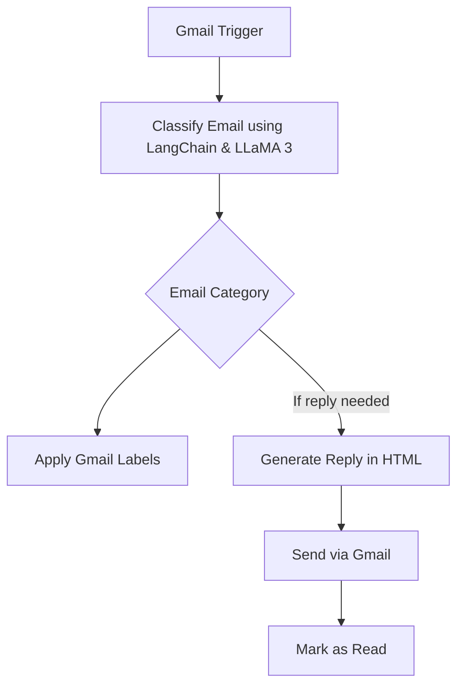

# 💌 Zoya – AI-Powered Gmail Assistant

Meet **Zoya** – your intelligent, polite, and professional email assistant powered by **n8n**, **LangChain**, and **Groq's LLaMA 3**. Designed for **Sir Asad**, Zoya seamlessly monitors Gmail, organizes messages into smart categories, and sends warm, respectful replies to selected contacts – so you never miss a beat in your inbox.

---

## ✨ What Can Zoya Do?

- ⏱ **Real-Time Monitoring**: Checks your Gmail inbox every minute.
- 🤖 **AI-Powered Classification**: Automatically classifies emails into:
  - 📢 Promotions
  - 👥 Social
  - 👨‍👩‍👧 Personal
  - 🔔 Updates
  - 💼 Recruiters
  - 📦 Miscellaneous
  - 🚫 No Reply
- 🏷 **Smart Labeling**: Applies the correct Gmail label automatically.
- ✍️ **Automated Replies**: Sends a customized, courteous reply as _“Zoya, Assistant to Sir Asad”_.
- 🧹 **Inbox Maintenance**: Marks handled emails as **read** to keep things tidy.

---

## 🔧 Setup & Installation

### 🔗 Prerequisites

Before you begin, make sure you have:

- [✅ n8n installed](https://n8n.io/)
- ✅ A Gmail account with [OAuth2 credentials configured](https://docs.n8n.io/integrations/builtin/app-nodes/n8n-nodes-base.gmail/)
- ✅ A [Groq API Key](https://console.groq.com/) for LLaMA 3 access
- ✅ LangChain credentials (built into n8n AI nodes)

### 📥 Import the Workflow

1. Launch your **n8n Editor UI**
2. Click the menu (☰) → **Import workflow**
3. Upload `personal_gmail_agent.json`
4. Click **Save**

### 🔐 Connect Credentials

- Assign your **Gmail OAuth2** credentials to all Gmail nodes
- Set up your **Groq API Key** in credentials under `Groq account`

### ✅ Activate Zoya

Switch the workflow **ON**, and Zoya will start her email magic instantly!

---

## 🧠 Behind the Scenes – How Zoya Works



## Zoya uses advanced LLM logic to understand, sort, and respond with style.

---

## 💬 Example Reply (HTML Email)

```html
<html>
  <body>
    <p>Dear [Sender's Name],</p>

    <p>I hope this message finds you well.</p>

    <p>My name is <strong>Zoya</strong>, and I am the assistant to <strong>Sir Asad</strong>. I would like to inform you that your email has been successfully forwarded to Sir Asad. He will review your message and get in touch with you shortly.</p>

    <p>Best regards,<br>
    Zoya<br>
    Assistant to Sir Asad</p>
  </body>
</html>
````
----

## 🗂 Project Structure

```bash
zoya-gmail-agent/
├── personal_gmail_agent.json   # n8n workflow export file
└── README.md                   # This file
```
----
---

## 🧩 Tech Stack

- **n8n** – Workflow Automation  
- **Gmail API** – OAuth2 Authentication & Email Handling  
- **LangChain** – AI Orchestration Framework  
- **Groq + LLaMA 3** – LLM Inference Engine

---

## 👤 About Zoya

Zoya is more than automation – she’s your AI-powered email concierge, delivering polished responses with a human touch.

She was designed to make your inbox **calm**, **clear**, and **classy** – one message at a time.

---

## 🤝 Contributing

Pull requests and improvements are welcome!  
Let’s make inbox automation elegant — together.

---
## Made with ❤️ and LLaMA 3 — by Sir Asad
